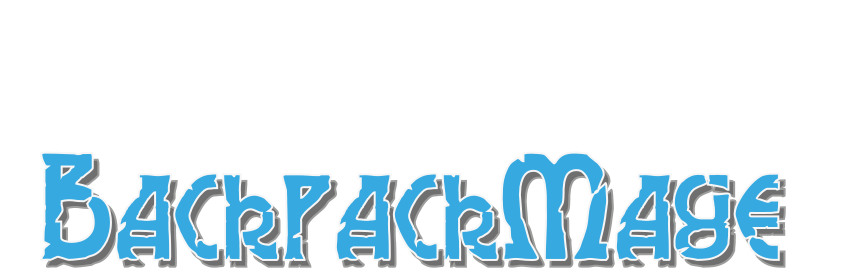
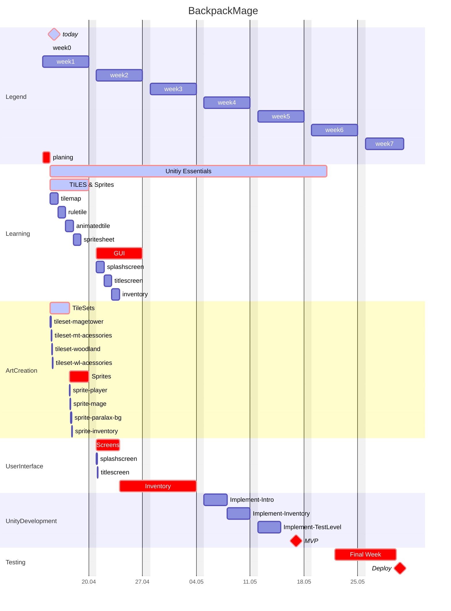
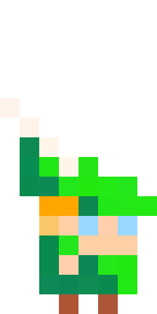
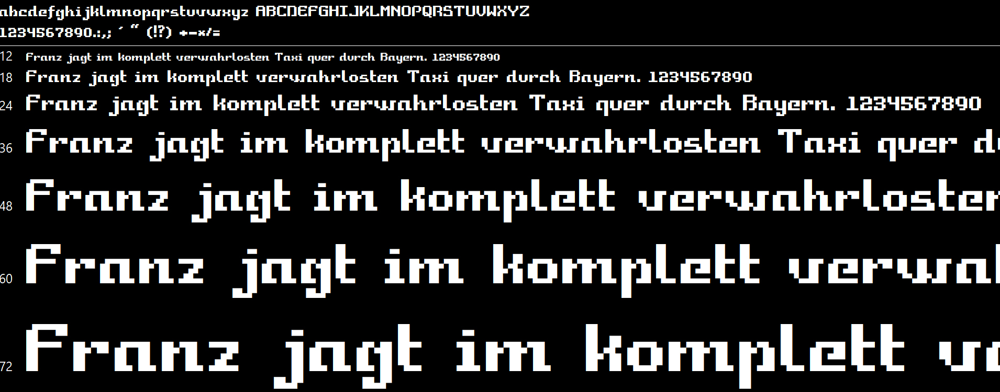

# *2D Side-Scrolling-RPG mit einem Twist*

  
  $\LARGE\color{orange}{\ Klicke\ }$ 👉🏼 $\LARGE\color{royalblue}{hier\ }\color{lightgray}{um\ die\ Entwicklung\ zu\ verfolgen}$ 

# Sprites

- ### Players 

    > 

  

## Spielprinzip:
- Ihr steuert einen mürrischen Abenteurer, der eigentlich nur seine Ruhe will – doch ein sadistischer Magier zwingt euch mit einem Fluch ihn herumzutragen!
- In diesem 2D Side-Scrolling-RPG müsst ihr Quests erfüllen, Monster bekämpfen und mit dem ständigen Spott des Magiers leben, der euch leiden sieht.
- Werdet ihr den Zauber brechen und euch befreien – oder bleibt ihr für immer sein Spielzeug?

---

## Spielgenre und Zielgruppe

### Genre:
Ich habe mich für einen 2D Inventory-Manager entschieden, mit Elementen eines 2D Side-Scrolling-RPGs umgesetzt in Pixelgrafik.

### Warum?
- RPGs bieten Raum für eine tiefgründige Geschichte und Charakterentwicklung, was perfekt zu meinem Konzept passt: Ein widerwilliger Abenteurer trifft auf einen sadistischen Magier und steckt ihn in seinen Rucksack.
- Die Pixelgrafik verleiht dem Spiel einen nostalgischen, Retro-Charme, der nicht nur bei Indie-Fans gut ankommt.
- Die Genres Herobuilder und Inventory-Manager erfreuen sich momentan großer Beliebtheit aufgrund ihrer Einsteigerfreundlichkeit und hohen Wiederspielwertes.

  

---

## Spielziele

### Was sollen Spieler:innen erreichen?
- Die Spieler steuern den Abenteurer durch vom Magier aufgezwungene Quests und Abenteuer.
- Die Hauptaufgabe ist es, diese Missionen zu erfüllen, um den Magier zufriedenzustellen – und vielleicht einen Weg zu finden, den Fluch zu brechen.
- **Niederlage**: Zu oft scheitern oder Bedingungen nicht erfüllen, was dazu führt, dass der Magier die Kontrolle übernimmt oder der Abenteurer stirbt.

---

## Hauptmechaniken

### Zentrale Mechaniken:
  - **Bewegung und Erkundung**: Side-Scrolling-Steuerung durch Wälder, Dungeons und Dörfer (z.B. mit WASD).
  - **Kampf**: Einfaches Echtzeit-Kampfsystem (Klicken zum Angreifen).
  

    
  

  - **Inventory-Management**: Grid-basiertes Inventar zum Sammeln und Verwalten von einer großen Anzahl an Gegenständen, Waffen und Ausrüstungen.
  

    
  

  - **Charakterentwicklung**: Finde Gegenstände durch Quests und Kämpfe, um Fähigkeiten zu verbessern.
  - **NPC-Interaktion**: Dialoge mit NPCs für Quests, Infos oder Handel.
  - **Magier-Mechanik**: Der Magier greift zufällig ein, z.B. mit Hindernissen oder temporären Boni/Mali.

---

## USP (Unique Selling Point)

### Was macht das Spiel besonders?
Die einzigartige Dynamik zwischen dem widerwilligen Abenteurer und dem sadistischen Magier!
Diese Beziehung sorgt für Humor (z.B. der Magier verspottet den Spieler) und Spannung (gefährliche Situationen).
Zusätzlich parodiert das Spiel RPG-Tropen: Der Held will gar kein Held sein, wird aber dazu gezwungen.

---
### Zielgruppe:
- Alter: 16–35 Jahre
- Interessen: RPG-Fans, Indie-Gamer, Liebhaber von schwarzem Humor und Retro-Stil
- Warum? Die Mischung aus Humor, Herausforderung und einer einzigartigen Beziehung zwischen Abenteurer und Magier spricht vor allem Spieler an, die narrative Tiefe und kreative Konzepte schätzen.

---

## Umsetzung in Unity

- **Grafik**: Pixel-Art-Assets.
- **Steuerung**: WASD/Pfeiltasten, Spacebar - für Side-Scrolling-Bewegung.
- **Kampfsystem**: Einfache Klick-Attacken, mit Synergien durch mitgenommene Gegenstände.
- **Inventory**: Grid-System mit Drag-and-Drop-Funktion.
- **Quests**: Quest-Log mit Fortschrittsskripten.
- **Dialogsystem**: Textboxen mit Auswahlmöglichkeiten.
- **Magier-Mechanik**: Events gesteuert durch mitgeführte Gegenstände und Spielfortschritt via Skripte.

---

### Zusammenfassung
Dieses 2D Side-Scrolling-RPG kombiniert klassische RPG-Elemente mit einer frischen, humorvollen Prämisse: Ein Abenteurer, der unter dem Fluch eines sadistischen Magiers leidet, kämpft widerwillig um seine Freiheit. Mit Pixelgrafik, zugänglichen Mechaniken und einer starken Story ist es ideal für Indie-Fans und RPG-Liebhaber!

---

## MoodBoard

### Level:

---

# Benutzte Grafiken und Schriften

### Font -  *ExpressionPro*:

### Beispiel Monster, Charaktere & Items:

---
### Angepasstes Tileset - *Tranquill*:

  

