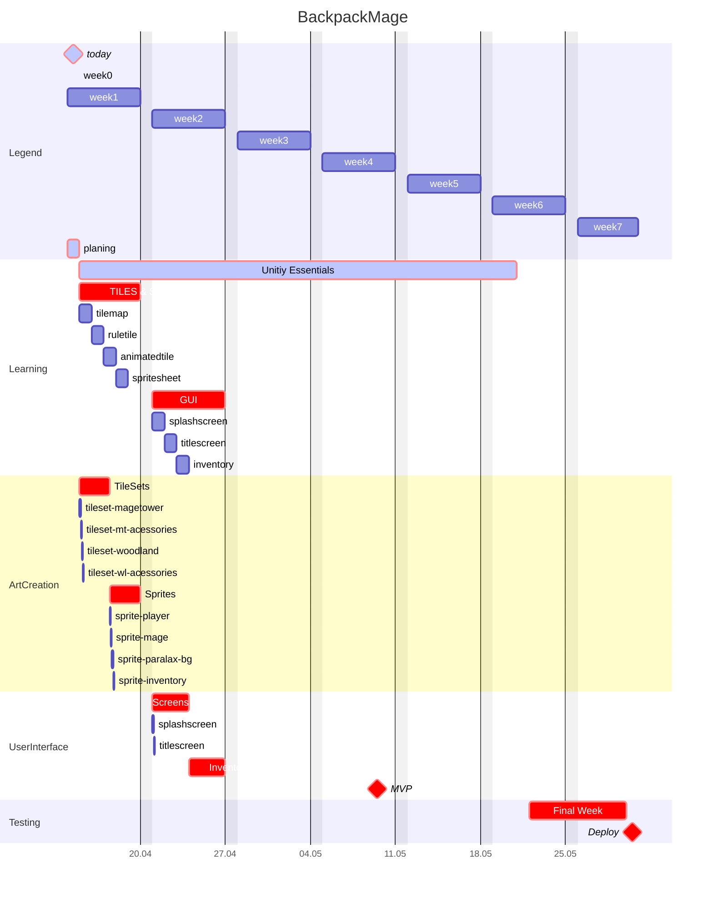

```mermaid
gantt
    %%   T I T L E
    title BackpackMage

    dateFormat DD-MM-YYYY
    excludes sunday

    axisFormat %d.%m

    section Legend
        today : milestone, crit, active, t0, 14-04-2025, 24h
        week0 : w0, 15-04-2025, 1m
        week1 : w1, 14-04-2025, 6d
        week2 : w2, 21-04-2025, 6d
        week3 : w3, 28-04-2025, 6d
        week4 : w4, 05-05-2025, 6d
        week5 : w5, 12-05-2025, 6d
        week6 : w6, 19-05-2025, 6d
        week7 : w7, 26-05-2025, 5d

        planing               : active , crit , plan , 14-04-2025 , 1d
    section Learning
        Unitiy Essentials     : active , crit ,  U , after w0 , 31d

        TILES & Sprites       :          crit ,  t , after w0 ,  5d
        tilemap               :                 tm , after w0 ,  1d

        ruletile              :                 tr , after tm   ,  1d
        animatedtile          :                 ta , after tr   ,  1d
        spritesheet           :                  s , after ta   ,  1d


        GUI                   :          crit ,  g , after w1 ,  6d
        splashscreen          :                  s , after w1 ,  1d
        titlescreen           :                 ts , after s    ,  1d

        inventory             :                   i, after ts   ,  1d


    section ArtCreation

        %%   T I L E S E T S
        TileSets              :          crit , tis , after w0 , 60h
        tileset-magetower     :                 tsm , after w0 , 2h
        tileset-mt-acessories :                tsma , after tsm  , 2h
        tileset-woodland      :                 tsw , after tsma , 2h
        tileset-wl-acessories :                tswa , after tsw  , 2h

        %%   S P R I T E S
        Sprites               :          crit , spr , after tis  , 60h
        sprite-player         :                 spp , after tis  , 2h
        sprite-mage           :                 spm , after spp  , 2h
        sprite-paralax-bg     :                spgb , after spm  , 2h
        sprite-inventory      :                spin , after spgb , 2h

    section UserInterface
        Screens               :          crit , scr , after w1 , 3d
        splashscreen          :                spls , after w1 , 2h
        titlescreen           :                tits , after spls , 2h

        Inventory             :          crit , inv , after scr  , 3d


    %%   M I N I M A L   V I A B L E   P R O J E C T
    %%
    MVP                       : milestone , crit , 18-05-2025

    section Testing
        Final Week            :          crit , fiw , 22-05-2025 , 7d

    %%   D E P L O Y M E N T
    %%
    Deploy                    : milestone , crit , 31-05-2025

```
