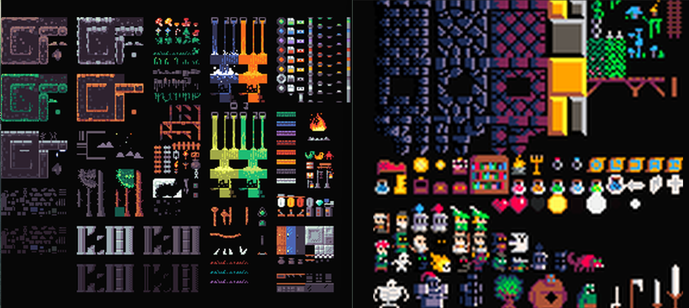

<!-- ------------- B A C K P A C K M A G E ------------- -->

###### 
 Medientechnik - 2025 <b>Ritt Jan</b>

> Ich habe die **Abgabe** meines Spiele-Prototypen in folgende **Bereiche  gegliedert**,   um die *Übersichtlichkeit und Zugänglichkeit* zum Projekt zu verbessern.

---
## 
 Spiele-Prototyp  

- 🗃️ <a href="https://github.com/IxI-Enki/backpackmage" title="Projekt-Proposal & Dokumentation der Ausarbeitung durchstöbern" alt="link to doku"> Hier </a> finden Sie Proposal & Dokumentation. 📌
- 💾 <a href="https://github.com/IxI-Enki/backpackmage-webgl" title="WebGL-Browsergame live testen & downloadbare Applikationen durchstöbern" alt="link to downloads"> Hier </a> finden Sie alle Downloads & Browser-Versionen aufgelistet. 📌

---
### Zusatz-Challenge:
  - **Eine Grafik**-Datei sei als kreativer, initialer Anstoß gegeben.   Die einzige, unverändert-benutzte Datei ist die Schriftart des Titels. 

  - **Alles Nötige(Art,Sound,Code,...) wird in kleinteiliger, liebevoller Handarbeit selbst gemacht**. (Als Hobby&Lern-Projekt wird weiter daran gebaut werden 😊)
  - **Kein** Assetstore, keine fertigen Prefabsl, keine fertigen Soundfiles, kein fremder Code.   Keine generierten Grafiken, Prefabs, Code, Musik oder sonst etwas. ( *KI wurde <u>nur</u> dazu verwendet, Konzepte zu erklären* )

---
#### 🖤 Großen Dank an die besten ***Sounddesigner*** :
  - <a href="https://soundcloud.com/christian-graf-308453287" alt="link-to-cris-soundcloud" title="Besuche sein Soundcloud" >Cri7u 🎵🎛️</a>
  - <a href="https://404" alt="link-to-hansis-space" title="">Hans Peter 🎶🎸</a> (kein öffentliches Profil)

---

  | $\large\color{royalblue}{Features\qquad }\small\color{grey}{Version\ 0.1.5-Prototype}$ | |
  | -------- | --------------- |
  |||
  | ***Handmade 2D pixel art assets including normal maps*** | |
  | ***Handmade music*** | |
  | *Player can* | Move, jump, fall, dash Attack |
  | *Enemies can* | Move, jump, fall, chase player Detect & avoid walls & drop-downs Detect player & enemies Take damage & die |
  | *2D side-scrolling world* | Tilesets, ruletiles, animated tiles Background parallax Lighting - scriptable flickering Death on drop-down |
  | *UI for* | Splash screen Title screen Exploration scene Pause - overlay Game over scene Android - overlay (if needed) Floating damage numbers Scriptable text animations |
  | *Controller options* | Keyboard Gamepad / controller Android overlay (for APK & WebGL)
  | *Platforms* | Windows Linux Mac Android WebGL (browser) |
  | *Used advanced graphs* | Rendergraph - for black outlines Unity animation graph - sprite animations |

<!-- ------------------- 𓂍 ꂅnki 𓂍 -------------------- -->

<a href="https://github.com/IxI-Enki" alt="link-to-enkis-github" title="Besuche das Github Profil des Erstellers">by Jan Ritt  <b> 𓂍 ꂅnki 𓂍 </b></a>

<!-- ------------------- 𓂍 ꂅnki 𓂍 -------------------- -->
